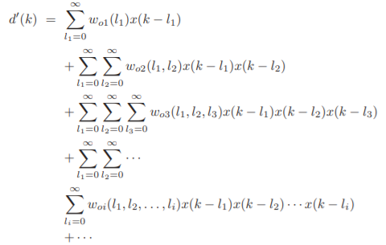
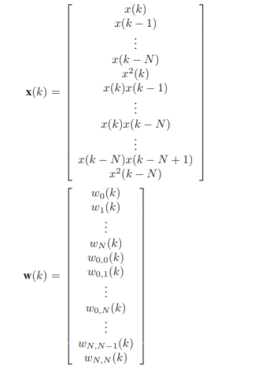

# volterraLMS
Volterra LMS Filter implementations.

## Volterra LMS Filters
Volterra series are widely used in nonlinear system modeling. The Volterra series expansion of a nonlinear system consists of a nonrecursive series in which the output signal is related to the input signal as

d'(k) is the desired system output, and woi are the **Volterra Kernels** of the system. In order to apply the LMS algorithm to a nonlinear LMS filter, we have to interpret the input vector **x** and the weight vector **w** in a different manner. For the N-th order filter with 2nd order Volterra series, we have:

## DVM-LMS Filters
The Decomposable Volterra Model (DVM) is described in detail in [2]. There is a decomposability condition, and through it the algorithm reduces the number of computations for the Volterra kernels from O(MK) to O(KM), where K is the series order and M is the filter order.

## Updates
26/08/2020 - There are still some problems being investigated regarding to higher order filters and series. The algorithms do not run for particular filter/series orders.

## References
[1] Diniz, Paulo S. R. - Adaptive filtering: algorithms and practical implementation (2013).
[2] Pinheiro, F. C. & Lopes, C. G. - A Low-Complexity Nonlinear Least Mean Squares Filter Based on a Decomposable Volterra Model. IEEE Trans. Signal Process. 67, 5463–5478 (2019).
